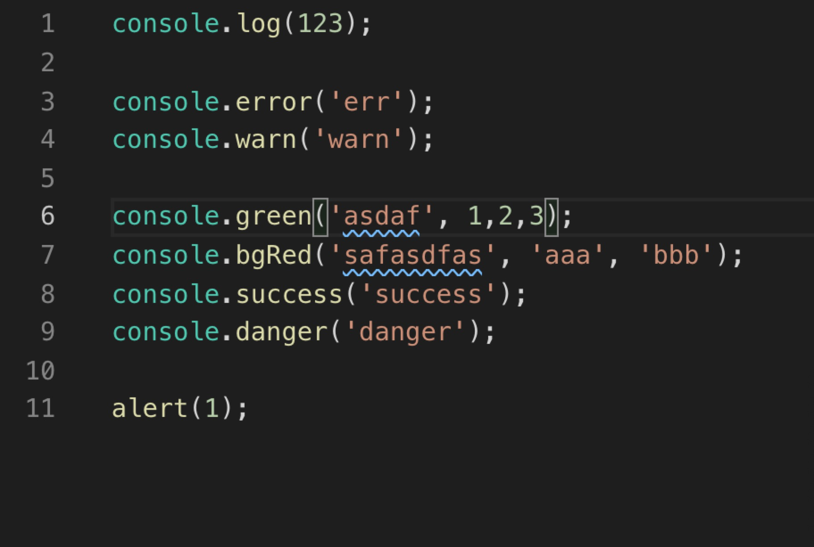
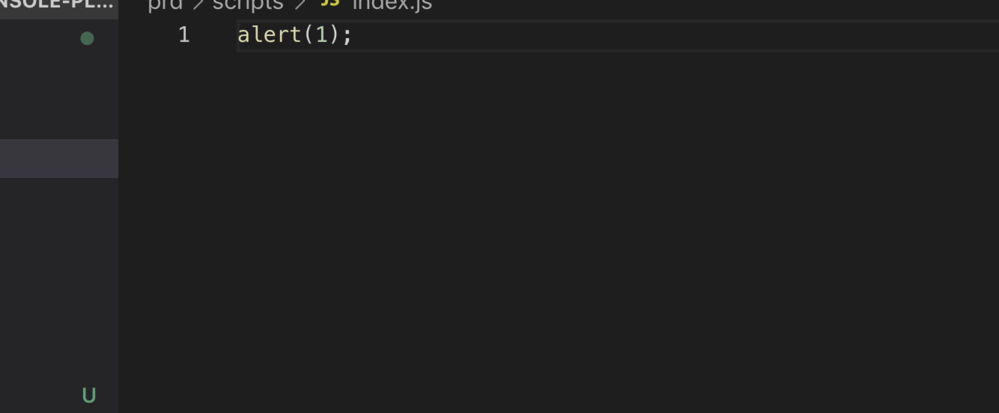
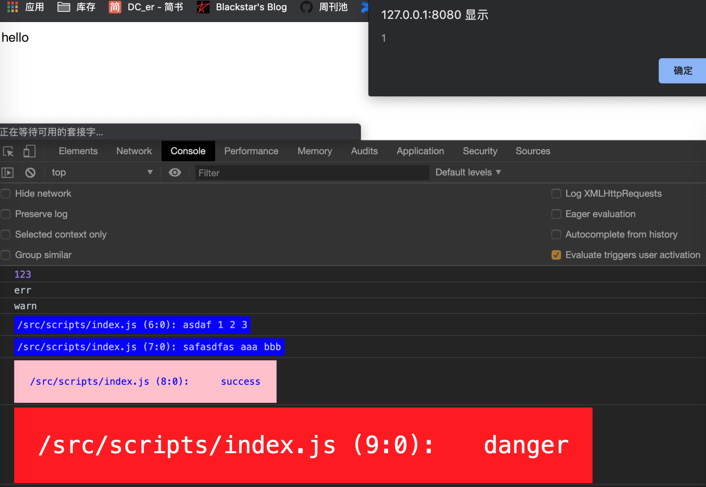

<div align="center">
  <a href="https://gridea.dev">
    
  </a>
  <h1 align="center">
    Gridea
  </h1>
  <h3 align="center">
    A static blog writing client
  </h3>

  [Download](https://github.com/getgridea/gridea/releases) | [Homepage](http://hvenotes.fehey.com/)

  <a href="https://github.com/getgridea/gridea/releases/latest">
    
  </a>

  <a href="https://github.com/getgridea/gridea/blob/master/LICENSE">
    
  </a>
  
  <a href="https://github.com/getgridea/gridea/releases/latest">
    
  </a>

</div>

<div align="center">
  

</div>
# babel-plugin-console-transform

:rainbow:babel插件，`生产环境`下可以删除所有的console，`开发环境`下可以使用扩展的console api，比如打印颜色，而且还会输出代码文件和行数列数。

举个栗子🌰

>源码：

生产环境：

非生产环境：

效果：


## 安装

```
npm install --save-dev babel-plugin-console-transform
```
or
```
yarn add --dev babel-plugin-console-transform
```

## 使用

在.babelrc.js引入插件并配置

```javascript
const consoleTransformPlugin = require('babel-plugin-console-transform');

module.exports = {
    plugins: [
        [
            consoleTransformPlugin,
            {
                env: 'production',
                removeMethods: ["*g*"],
                additionalStyleMethods: {
                    'success': 'padding:20px; color: blue;background:pink;',
                    'danger': 'padding:30px;background:red; font-size:30px; color:#fff;'
                }
            }
        ]
    ]
}
```

## 配置项说明

| **配置项名称** | **是否必须** | **含义** | **类型** | **举例** |  
| --- | --- | --- | --- | --- |  
| env | 是 | 运行环境 | string | production, development|  
| removeMethods  | 否 | production下删除的方法，默认删除全部 | Array<string \| Function> |  ['log', 'warn'], [(args) => args.includes('dont remove'), 'log']
| additionalStyleMethods | 否  | 额外添加的console方法 | {[key: string]: string}|  {'success': 'background: green;'}|

其他说明：

1. `env`是用于切换环境，生产环境下会删除console.xxx()，开发环境下会扩展一些方法，配置时可以使用 process.env.NODE_ENV指定
2. `removeMethods`之后在env为production时才会生效，支持[glob模式](https://github.com/mrmlnc/fast-glob#basic-syntax)的字符串，比如 \*\*g**, **bg{Red,Green}等，也支持函数，参数为console方法的参数，用于一些需要根据参数确定是否删除console的场景。
3. `additionalStyleMethods`可以扩展一些方法，而且可以覆盖原生的log等方法
4. 所有扩展的方法都会额外打印文件路径和代码所在行列数
   

   
